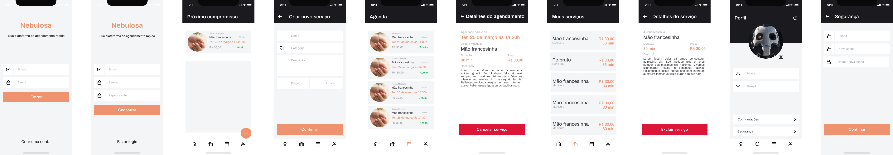

# Nebulosa - Mobile Provider

Essa aplicação faz parte do projeto Nebulosa, no qual venho construindo para a
apresentação de TCC da Universidade Paulista - UNIP. Esse repositorio representa
a versão da aplicação voltada para o profissional que trabalham utilizando o projeto.



## Requisitos

- [NodeJS](https://nodejs.org/en/) - 14.x
- [Expo CLI](https://docs.expo.dev/workflow/expo-cli/) - 4.10.0
- [Expo client](https://play.google.com/store/apps/details?id=host.exp.exponent&hl=pt_BR&gl=US)

## Executanto

Baixando o repositorio

```bash
$ git clone https://github.com/DenisMedeirosSDK/Nebulosa-Mobile-Provider.git

$ cd Nebulosa-Mobile-Provider
```

Instale as dependencias: `npm install` ou `expo install`

Execute a aplicação: `npm run start`

Abra seu emulador: `npm run android` ou `npm run ios`

Espere até o final da instalação para começar a usar.

---

**Construido por: @DenisMedeirosSDK**
